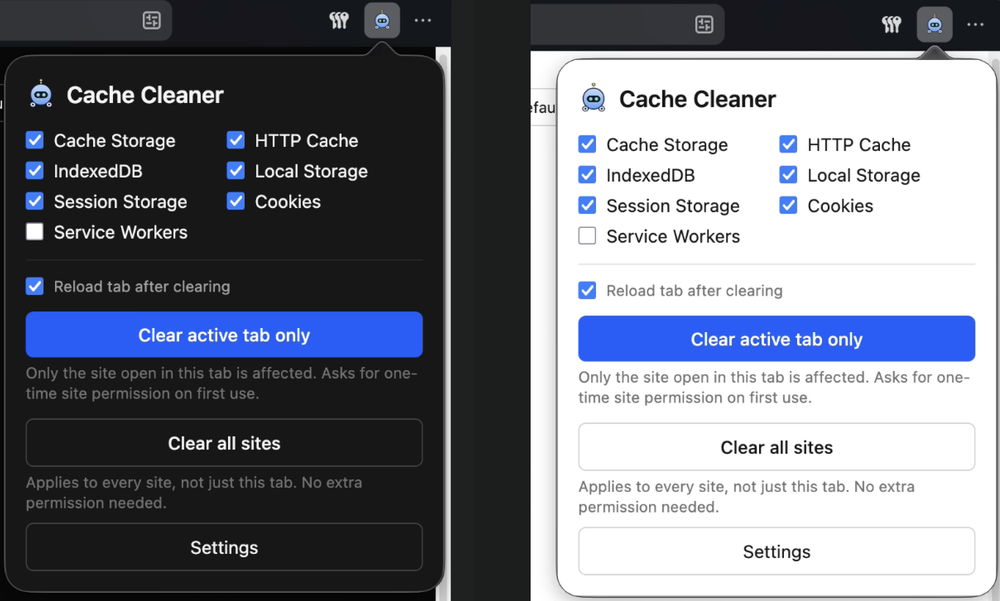
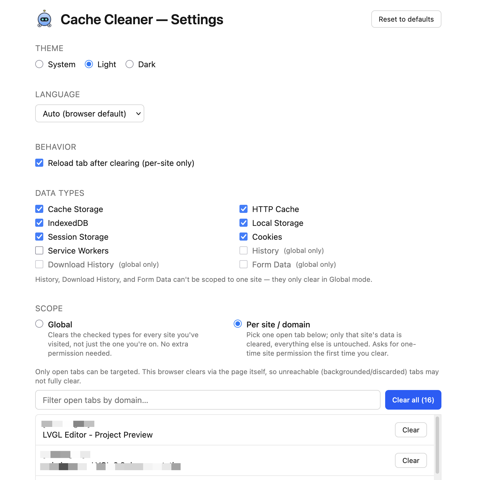
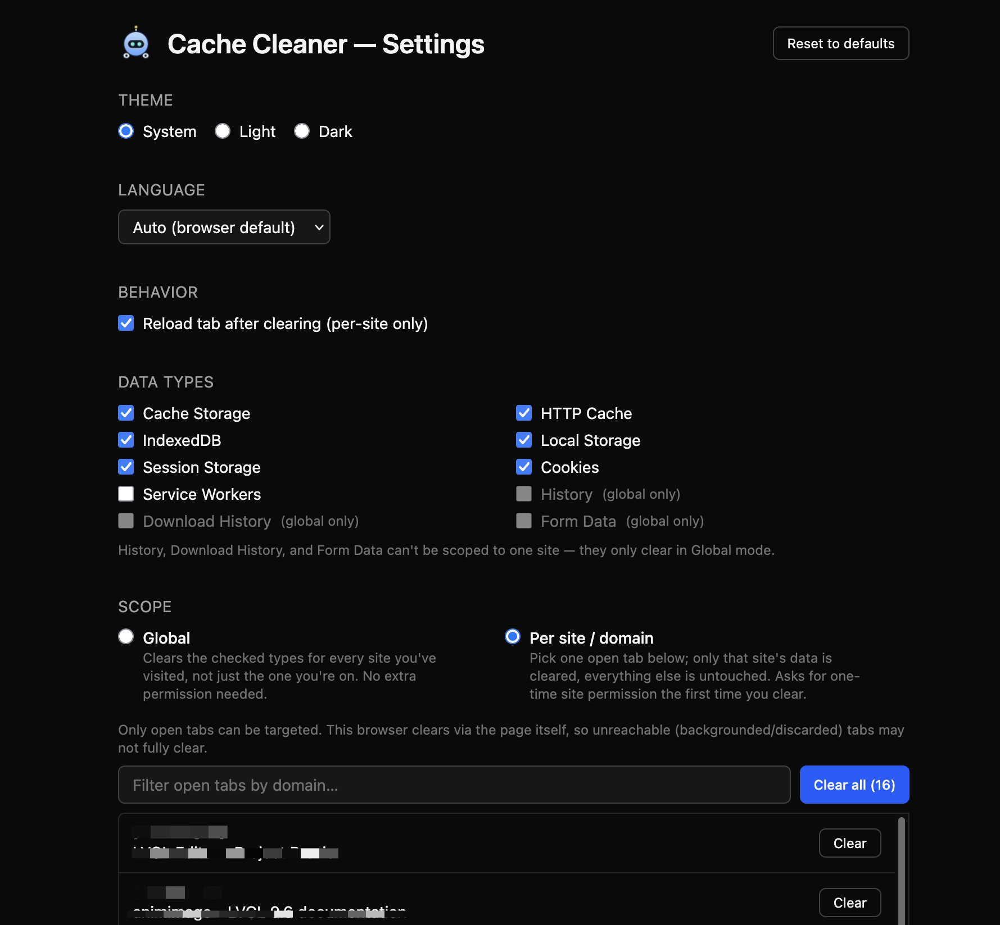

# Bleep - Fast Global & Tab Cache Cleaner

A browser extension for clearing cache, cookies, storage, history, and other
browsing data — either globally across every site, or scoped to just the one
open tab you're looking at.

  

## Features

- **Granular data types**: Cache Storage, HTTP Cache, IndexedDB, Local
  Storage, Session Storage, Cookies, Service Workers, History, Download
  History, Form Data — pick exactly what to clear.
- **Two scopes**:
  - **Global** — clears the checked types across every site you've visited.
  - **Per site / domain** — clears data for one open tab only, leaving every
    other site untouched.
- **Quick actions in the popup** — clear the active tab or everything with
  one click, without opening the full Settings page.
- **Full control in Settings** — the complete type list, a searchable/
  filterable list of open tabs for per-site clearing, bulk "clear all open
  tabs" action, and a recent-history browser with per-item delete.
- **Two-step confirmation** on the destructive "clear all sites" action —
  arms on first click, only fires on an explicit second click, auto-cancels
  after a few seconds if ignored.
- **Theme**: System / Light / Dark, following the OS by default.
- **Language**: Auto-detected from the browser (English, Russian, Romanian,
  Ukrainian), with a manual override — falls back to English for any other
  browser language.
- **Reset to defaults** button to restore all settings in one click.

  

  

## How it works

### Global clearing

Uses the browser's [`browsingData`](https://developer.chrome.com/docs/extensions/reference/api/browsingData)
API directly. No extra permission is needed beyond what's declared in the
manifest.

### Per-site clearing

There's no single cross-browser API for "clear this one site's data":

- **Chromium (Chrome, Edge, Brave, ...)** — `browsingData.remove` accepts an
  `origins` filter, so per-site clearing goes straight through that API.
- **Firefox and Firefox-based browsers (Zen, LibreWolf, ...)** — Firefox's
  `browsingData` has no per-origin filter at all. Instead, the extension
  injects a small content script into the target tab and clears
  `caches`, `indexedDB`, `localStorage`/`sessionStorage`, cookies, and
  Service Worker registrations directly from the page's own context. This
  only reaches the non-`HttpOnly` cookies for the tab's current path/domain,
  and only works on tabs that are actually open (a backgrounded or
  discarded tab can't be injected into).

Which browser you're on is detected via `runtime.getBrowserInfo` — a
Gecko-only API present in Firefox and its forks, absent in Chromium. Its
_presence_ (not the self-reported name, which forks often report as
`"Firefox"` for compatibility) is what selects the code path.

Per-site clearing always asks for a one-time, optional host permission on
first use — `*://*/*`, declared as `optional_host_permissions` rather than a
required permission, so it's not requested at install time.

## Supported browsers

| Browser                                             | Minimum version | Notes                                                                               |
| --------------------------------------------------- | --------------- | ----------------------------------------------------------------------------------- |
| Chrome / Chromium / Edge / Brave                    | 88+             | Manifest V3, `scripting` API, `browsingData` origin filtering                       |
| Firefox                                             | 128+            | `optional_host_permissions` support; per-site clearing via content-script injection |
| Firefox-based forks (Zen, LibreWolf, Waterfox, ...) | Same as Firefox | Detected via `runtime.getBrowserInfo`                                               |

Load unpacked for manual testing:

- **Chrome**: `chrome://extensions` → enable Developer mode → "Load unpacked"
  → select `.output/chrome-mv3`.
- **Firefox**: `about:debugging` → "This Firefox" → "Load Temporary Add-on"
  → select `.output/firefox-mv3/manifest.json`.

## Versioning

Releases follow [Semantic Versioning](https://semver.org/). Each tagged
release on [GitHub Releases](https://github.com/utopiaeh/bleep/releases)
has auto-generated notes listing every commit since the last tag.

## Publishing

See [PUBLISHING.md](./PUBLISHING.md) for the Chrome Web Store and Firefox
Add-ons submission checklist.
